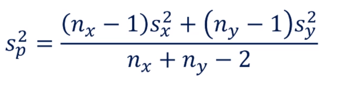
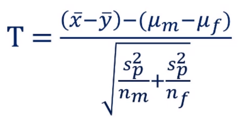
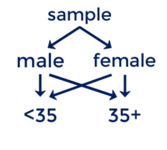

# Hypothesis Testing

## Gender pay gap

### Aim: To test if there is a significant difference in the salaries, based on gender.

Refer the excel sheet attached to this folder,

<i>if the values in one sample revel no information about the other, they are **Independent**</i>

Here using hypothesis test for mean salary.
-   H0 : &micro;male - &micro;female = 0
-   H1 : &micro;male - &micro;female &ne; 0

Data is categorized into two samples as for male and females, therefore we are using t-test since independent samples

Formula to calculate sample variance:
 

 
Formula to calculate T-Score:
 

 

After calculating the p-value(0.182) and found that 0.182 >> all common levels of significance like 99%, 95%, 90%
We cannot reject the null hypothesis, there isn't enough evidence that there is a gender wage gap in this firm.

Now let's segment the data into two groups as age less than 35 and greater than 35

